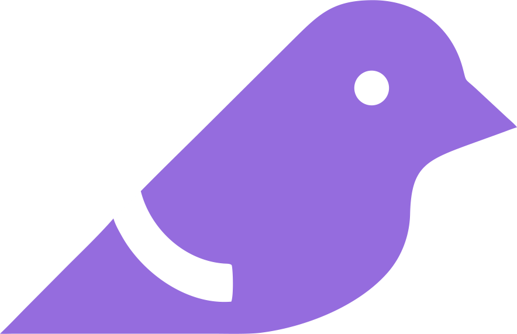

<div align="center">



<br />
<br />

# Finch

### Agentic Harness for Software Development Teams

[](https://github.com/AOByte/finch/actions/workflows/ci.yml)
[](https://www.typescriptlang.org/)
[](https://nestjs.com/)
[](https://react.dev/)
[](https://temporal.io/)
[](./LICENSE)

<br />

**Finch** orchestrates LLM-powered agents through the **TAPES** pipeline — a structured five-phase lifecycle with durable execution, human-in-the-loop clarification gates, and semantic memory that learns from every run.

[Getting Started](#getting-started) · [Architecture](#architecture) · [Tech Stack](#tech-stack) · [Documentation](#documentation) · [Contributing](#contributing) · [License](#license)

</div>

<br />

---

## Overview

Finch is not a chatbot. It is a **phased orchestration engine** that receives tasks through configured trigger sources, autonomously acquires context, produces an explicit plan, executes implementation work, and ships a deliverable — all while maintaining structured human-in-the-loop checkpoints wherever the agent identifies a gap in its understanding.

```
Task arrives (Slack / Webhook / Cron)
  -> TRIGGER   ->  TaskDescriptor
  -> ACQUIRE   ->  ContextObject         [Gate A - clarification possible]
  -> PLAN      ->  PlanArtifact          [Gate P - clarification possible]
  -> EXECUTE   ->  VerificationReport    [Gate E - clarification possible]
  -> SHIP      ->  ShipResult            [deterministic - no gate]
  -> Memory merged, run complete
```

### Key Capabilities

- **TAPES Framework** — Five deterministic phases: Trigger, Acquire, Plan, Execute, Ship
- **Clarification Gates** — Structured pauses when the agent self-identifies context gaps; no work is lost on resume
- **Semantic Memory** — Vector-based knowledge store that accumulates across runs, reducing gate frequency over time
- **Durable Execution** — Temporal-backed workflows survive crashes and resume from exact point of suspension
- **Multi-Agent Pipelines** — Configure multiple agents per phase; each enriches the canonical artifact and passes it forward
- **MCP Tool Discovery** — Agents discover and call external tools (Jira, GitHub, Slack) via Model Context Protocol with phase-scoped permissions
- **Connector System** — Pluggable integrations for Slack, Jira, GitHub, and any LLM provider
- **Complete Audit Trail** — Append-only log of every phase transition, gate firing, agent decision, and artifact handoff
- **Backward Traversal** — Gate resolutions can route back to earlier phases when new information warrants it

---

## Architecture

Finch is organized into five architectural layers:

```
┌──────────────────────────────────────────────────────┐
│  Layer 1 — Frontend (React + Vite + TanStack Router) │
├──────────────────────────────────────────────────────┤
│  Layer 2 — API Server (NestJS + Socket.io)           │
├──────────────────────────────────────────────────────┤
│  Layer 3 — Temporal Workflow Engine                   │
├──────────────────────────────────────────────────────┤
│  Layer 4 — Agent Layer (LLM-powered phase workers)   │
├──────────────────────────────────────────────────────┤
│  Layer 5 — Persistence (PostgreSQL + pgvector + Redis)│
└──────────────────────────────────────────────────────┘
```

### NestJS Module Tree

```
AppModule
├── OrchestratorModule    — Gate control, agent dispatch, rule enforcement
├── WorkflowModule        — Temporal worker and workflow definitions
├── AgentModule           — TAPES phase agents and agent configuration
├── ConnectorModule       — Slack, GitHub, Jira, Webhook, Cron integrations
├── MCPModule             — MCP registry, server factory, tool discovery
├── ConnectorSettingsModule — MCP server CRUD + health checks
├── LLMModule             — Anthropic Claude + OpenAI provider registry
├── MemoryModule          — Vector memory, staging, embeddings
├── AuditModule           — Append-only audit event logger
├── PersistenceModule     — Prisma service, repositories
├── WebSocketModule       — Real-time run updates via Socket.io
├── AuthModule            — JWT authentication and harness guards
└── ApiModule             — REST controllers and health endpoint
```

---

## Tech Stack

| Layer | Technology | Purpose |
|-------|-----------|---------|
| **Language** | TypeScript (strict) | Shared artifact schemas across all layers |
| **Runtime** | Node.js 20 LTS | Stable async runtime |
| **Backend** | NestJS 10 | DI container, module system, guards, WebSocket |
| **Workflows** | Temporal | Durable execution, pause/resume, crash recovery |
| **ORM** | Prisma | Type-safe DB client, migrations, JSONB artifacts |
| **Database** | PostgreSQL 16 + pgvector | Relational store + vector similarity search |
| **Cache / Queue** | Redis 7 + BullMQ | Pub/sub, job queues, WebSocket adapter |
| **Frontend** | React 18 + Vite | Fast HMR, component model |
| **Routing** | TanStack Router | Type-safe client routing |
| **State** | TanStack Query | Server state caching and background refetch |
| **WebSocket** | Socket.io | Real-time harness-scoped event distribution |
| **LLM** | Anthropic SDK + OpenAI SDK | Claude and GPT model integration |
| **Integrations** | Slack Bolt, Octokit, jira.js | Trigger, context, execution, and shipping |
| **MCP** | Model Context Protocol | Dynamic tool discovery for agents per phase |
| **Testing** | Vitest + Supertest | Unit and integration testing with 100% coverage |
| **Logging** | Pino | Structured JSON logs |
| **CI/CD** | GitHub Actions | Lint, typecheck, test, and build pipeline |

---

## Getting Started

### Prerequisites

| Tool | Version |
|------|---------|
| **Node.js** | >= 20 LTS |
| **pnpm** | >= 9 |
| **Docker** | Latest with Docker Compose |

### 1. Clone the Repository

```bash
git clone https://github.com/AOByte/finch.git
cd finch
```

### 2. Install Dependencies

```bash
pnpm install
```

### 3. Start Infrastructure

```bash
docker compose -f infra/docker-compose.yml up -d
bash infra/healthcheck.sh
```

This starts:

| Service | Port | Description |
|---------|------|-------------|
| **PostgreSQL** (pgvector) | `5432` | Primary database with vector search |
| **Redis** | `6379` | Cache, queues, and pub/sub |
| **Temporal** | `7233` | Workflow execution engine |
| **Temporal UI** | `8080` | Workflow monitoring dashboard |

### 4. Run Database Migrations & Seed

```bash
pnpm --filter api prisma generate
pnpm --filter api prisma migrate deploy
pnpm --filter api prisma db seed
```

### 5. Start the API

```bash
pnpm --filter api dev
```

> API runs on [http://localhost:3001](http://localhost:3001) — Health check: `GET /health`

### 6. Start the Frontend

```bash
pnpm --filter web dev
```

> Web app runs on [http://localhost:3000](http://localhost:3000)

### 7. Open Temporal UI

> Temporal dashboard: [http://localhost:8080](http://localhost:8080)

---

## Testing

Finch has **100% line coverage** across both backend and frontend.

### Unit Tests

```bash
# Backend (505 tests)
pnpm --filter api test run

# Frontend (6 tests)
pnpm --filter web test run
```

### Integration Tests

Requires running PostgreSQL infrastructure:

```bash
pnpm --filter api test:integration    # 30 MCP e2e tests + integration suite
```

### Coverage Reports

```bash
# Backend coverage
cd apps/api && npx vitest run --coverage

# Frontend coverage
cd apps/web && npx vitest run --coverage
```

| Target | Statements | Branches | Functions | Lines |
|--------|-----------|----------|-----------|-------|
| **api** | 99.92% (1259/1260) | 93.34% (505/541) | 99.01% (303/306) | 100% (1217/1217) |
| **web** | 100% (8/8) | 100% (0/0) | 100% (2/2) | 100% (8/8) |

### Type Checking

```bash
pnpm --filter api exec tsc --noEmit
pnpm --filter web exec tsc --noEmit
```

---

## Project Structure

```
finch/
├── apps/
│   ├── api/                    # NestJS backend
│   │   ├── src/
│   │   │   ├── agents/         # TAPES phase agent services
│   │   │   ├── api/            # REST controllers + health endpoint
│   │   │   ├── audit/          # Append-only audit logger
│   │   │   ├── auth/           # JWT authentication
│   │   │   ├── connectors/     # Slack, GitHub, Jira integrations
│   │   │   ├── connector-settings/ # MCP server CRUD + health checks
│   │   │   ├── mcp/            # MCP registry, server factory, adapters
│   │   │   ├── llm/            # LLM provider registry
│   │   │   ├── memory/         # Vector memory + embeddings
│   │   │   ├── orchestrator/   # Gate control + agent dispatch
│   │   │   ├── persistence/    # Prisma service + repositories
│   │   │   ├── websocket/      # Real-time Socket.io gateway
│   │   │   ├── workflow/       # Temporal worker + definitions
│   │   │   ├── app.module.ts   # Root module
│   │   │   └── main.ts         # Bootstrap entry point
│   │   ├── prisma/
│   │   │   ├── schema.prisma   # Database schema (13 tables)
│   │   │   ├── migrations/     # PostgreSQL migrations
│   │   │   └── seed.ts         # Default harness + admin user
│   │   └── tests/
│   │       ├── unit/           # Unit tests
│   │       └── integration/    # PostgreSQL integration tests
│   └── web/                    # React frontend
│       └── src/
│           ├── main.tsx        # App entry point
│           └── routes.tsx      # TanStack Router routes
├── docs/
│   ├── SDD.md                  # System Design Document
│   ├── PRD.md                  # Product Requirements Document
│   └── TAPES-paper.md          # TAPES framework specification
├── infra/
│   ├── docker-compose.yml      # PostgreSQL, Redis, Temporal
│   └── healthcheck.sh          # Infrastructure health verification
├── skills/                     # Domain knowledge for agent injection
├── AGENTS.md                   # Agent instructions & coding standards
├── RULES.md                    # Project rules and conventions
└── TASKS.md                    # Wave-based task tracking
```

---

## Database Schema

Finch uses **PostgreSQL 16** with the **pgvector** extension for semantic memory search. The schema includes:

| Table | Purpose |
|-------|---------|
| `users` | User accounts with bcrypt-hashed credentials |
| `harnesses` | Configured Finch deployment instances |
| `harness_members` | User-to-harness associations |
| `agent_configs` | Per-phase agent pipeline configuration |
| `runs` | TAPES lifecycle instances with status tracking |
| `phase_artifacts` | Canonical typed outputs of each phase |
| `gates` | Clarification gate events and resolutions |
| `audit_events` | Immutable append-only audit trail |
| `memories` | Vector embeddings for semantic memory |
| `memory_staging` | Per-run memory before final commit at Ship |
| `mcp_servers` | MCP server registrations per harness |
| `connector_configs` | Integration credentials and settings |
| `rules` | Behavioral constraints (hard/soft, path/semantic) |
| `skills` | Domain knowledge modules for agent injection |

**Key constraints:**
- Audit events are immutable (PostgreSQL rules block UPDATE and DELETE)
- CHECK constraints on `runs.status`, `runs.current_phase`, `rules.enforcement`, `rules.pattern_type`
- HNSW index on memory embeddings for fast vector similarity search

---

## Documentation

| Document | Description |
|----------|-------------|
| [AGENTS.md](./AGENTS.md) | Agent instructions, architecture, and coding standards |
| [System Design Document](./docs/SDD.md) | Complete system design, schemas, and API reference |
| [Product Requirements](./docs/PRD.md) | Product requirements and TAPES fidelity contract |
| [TAPES Paper](./docs/TAPES-paper.md) | The TAPES framework specification |
| [RULES.md](./RULES.md) | Project rules and conventions |
| [TASKS.md](./TASKS.md) | Wave-based task tracking and progress |

---

## Contributing

We welcome contributions! Please follow these steps:

1. **Fork the repository**
2. **Create a feature branch** (`git checkout -b feature/your-feature-name`)
3. **Make your changes** and ensure all tests pass
4. **Run type checks** (`pnpm --filter api exec tsc --noEmit && pnpm --filter web exec tsc --noEmit`)
5. **Run tests** (`pnpm --filter api test run && pnpm --filter web test run`)
6. **Commit your changes** (`git commit -m 'feat: add some feature'`)
7. **Push to your branch** (`git push origin feature/your-feature-name`)
8. **Open a pull request**

Please make sure to:
- Follow the coding conventions in [AGENTS.md](./AGENTS.md)
- Maintain 100% test coverage
- Keep commits atomic with descriptive messages following [Conventional Commits](https://www.conventionalcommits.org/)

---

## Issues

If you encounter any issues, please check the [Issues](https://github.com/AOByte/finch/issues) section first. When reporting a new issue, include:

- A clear and descriptive title
- Steps to reproduce the issue
- Expected vs. actual behavior
- Relevant logs, screenshots, or error messages
- Your environment (OS, Node.js version, Docker version)

---

## License

Distributed under the **MIT License**. See [LICENSE](./LICENSE) for more information.

```
MIT License

Copyright (c) 2026 AOByte

Permission is hereby granted, free of charge, to any person obtaining a copy
of this software and associated documentation files (the "Software"), to deal
in the Software without restriction, including without limitation the rights
to use, copy, modify, merge, publish, distribute, sublicense, and/or sell
copies of the Software, and to permit persons to whom the Software is
furnished to do so, subject to the following conditions:

The above copyright notice and this permission notice shall be included in all
copies or substantial portions of the Software.

THE SOFTWARE IS PROVIDED "AS IS", WITHOUT WARRANTY OF ANY KIND, EXPRESS OR
IMPLIED, INCLUDING BUT NOT LIMITED TO THE WARRANTIES OF MERCHANTABILITY,
FITNESS FOR A PARTICULAR PURPOSE AND NONINFRINGEMENT. IN NO EVENT SHALL THE
AUTHORS OR COPYRIGHT HOLDERS BE LIABLE FOR ANY CLAIM, DAMAGES OR OTHER
LIABILITY, WHETHER IN AN ACTION OF CONTRACT, TORT OR OTHERWISE, ARISING FROM,
OUT OF OR IN CONNECTION WITH THE SOFTWARE OR THE USE OR OTHER DEALINGS IN THE
SOFTWARE.
```

---

<div align="center">

**Built with the [TAPES Framework](./docs/TAPES-paper.md)** — Trigger · Acquire · Plan · Execute · Ship

<br />


</div>
